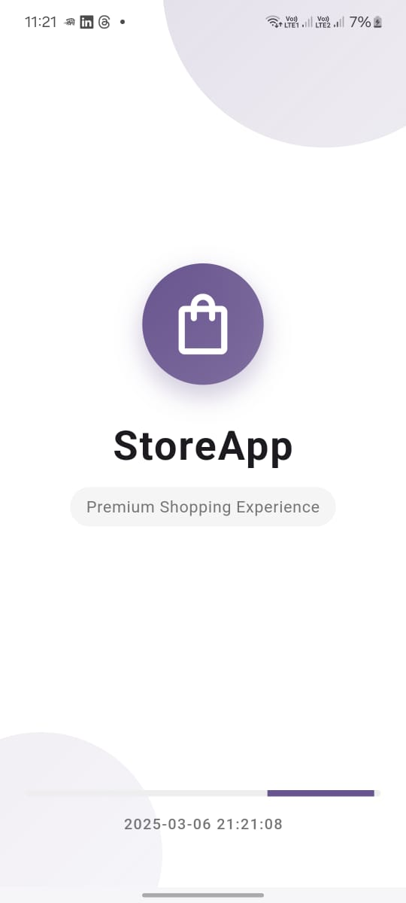
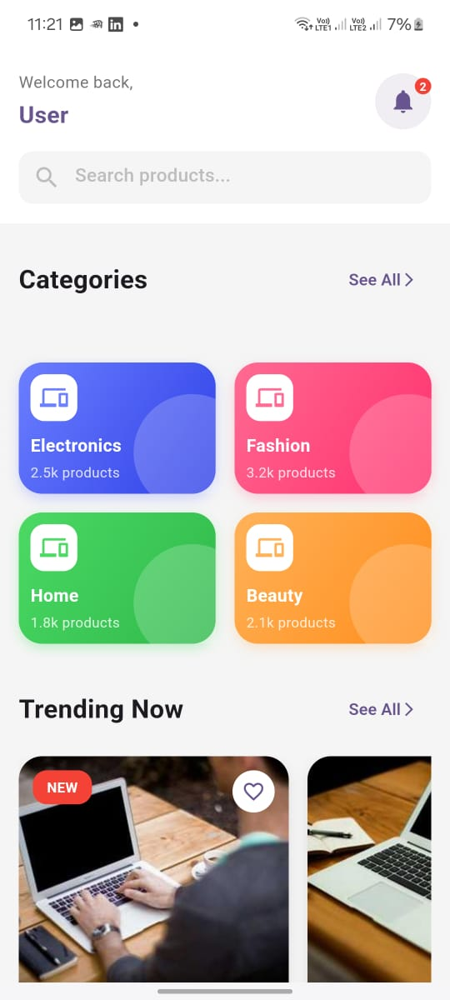
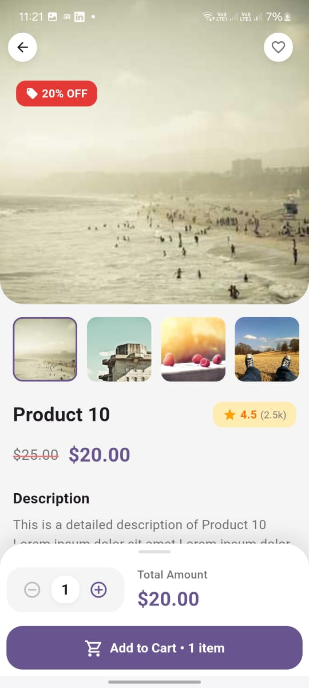

# StoreApp - Modern E-Commerce Application

A sleek and modern e-commerce mobile application built with Flutter, featuring a user-friendly interface and smooth animations.


## 🌟 Features

### 🎨 Modern UI/UX
- **Elegant Splash Screen**
  - Smooth animations and transitions
  - Real-time date/time display
  - User welcome screen
  - Brand-focused design

- **Category Navigation**
  - Intuitive category browsing
  - Beautiful gradient cards
  - Item count display
  - Seamless navigation

- **Product Discovery**
  - Trending products section
  - New arrivals highlight
  - Rating and review system
  - Price comparison features

### 💫 Interactive Elements
- **Dynamic Loading**
  - Skeleton loading states
  - Smooth image loading
  - Progress indicators
  - Pull-to-refresh functionality

- **Shopping Experience**
  - Add to cart animations
  - Favorite item selection
  - Quick action buttons
  - Price tracking

### 🛠 Technical Features
- **Performance Optimized**
  - Efficient image caching
  - Smooth scrolling
  - Responsive layouts
  - Memory optimization

- **State Management**
  - Provider pattern implementation
  - Clean architecture
  - Efficient data handling
  - Real-time updates

## 📱 Screenshots

<table>
  <tr>
    <td>Splash Screen</td>
    <td>Categories</td>
    <td>Product Details</td>
  </tr>
  <tr>
    <td></td>
    <td></td>
    <td></td>
  </tr>
</table>

## 🚀 Getting Started

### Prerequisites
- Flutter SDK (2.5.0 or higher)
- Dart SDK (2.14.0 or higher)
- Android Studio / VS Code
- Git

### Installation

1. Clone the repository
```bash
git clone https://github.com/ramy888/store_app.git
```

2. Navigate to project directory
```bash
cd store_app
```

3. Install dependencies
```bash
flutter pub get
```

4. Run the app
```bash
flutter run
```

## 🛠 Tech Stack

- **Frontend**: Flutter
- **State Management**: Provider
- **Design Pattern**: MVVM
- **Animation**: Custom Flutter animations
- **HTTP Client**: Dio
- **Image Loading**: Cached Network Image
- **Date Formatting**: Intl package

## 📂 Project Structure

```
lib/
├── models/          # Data models
├── providers/       # State management
├── screens/         # UI screens
│   ├── splash/
│   ├── categories/
│   └── products/
├── widgets/         # Reusable widgets
├── utils/          # Helper functions
└── main.dart       # Entry point
```

## 🎯 Future Improvements

- [ ] User authentication
- [ ] Shopping cart functionality
- [ ] Payment integration
- [ ] Order tracking
- [ ] Push notifications
- [ ] Dark mode support
- [ ] Multiple language support
- [ ] Wishlist feature

## 🤝 Contributing

1. Fork the Project
2. Create your Feature Branch (`git checkout -b feature/AmazingFeature`)
3. Commit your Changes (`git commit -m 'Add some AmazingFeature'`)
4. Push to the Branch (`git push origin feature/AmazingFeature`)
5. Open a Pull Request

## 📄 License

This project is licensed under the MIT License - see the [LICENSE](LICENSE) file for details

## 👤 Author

**Ramy888**

- Github: [@Ramy888](https://github.com/Ramy888)

---
⭐️ Star this repo if you like what you see!
